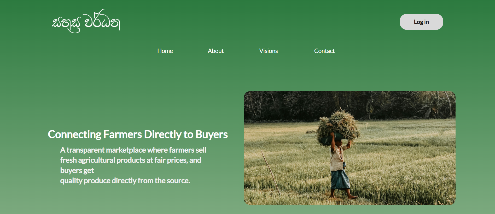
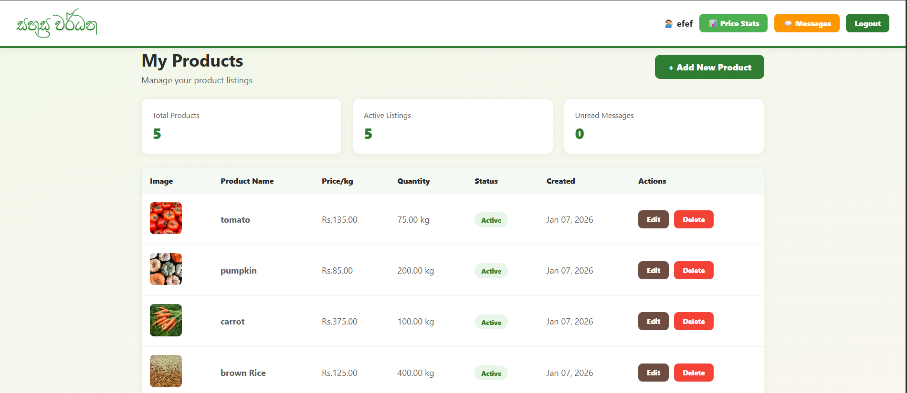
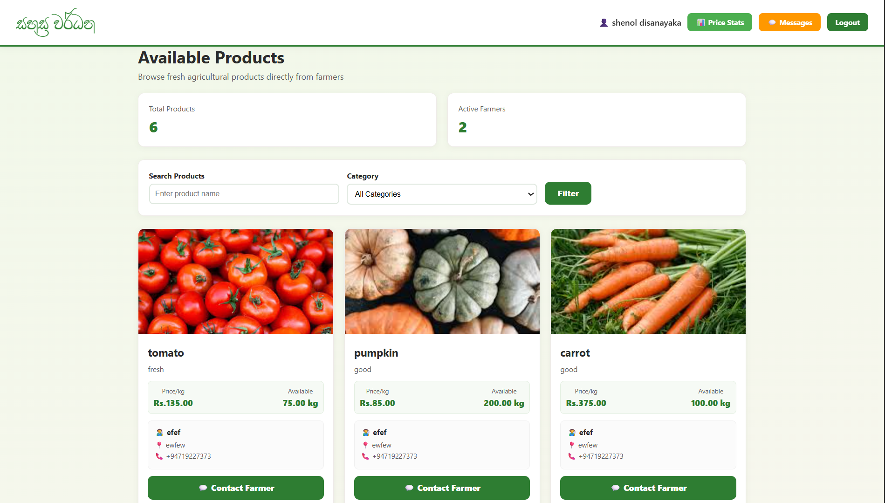
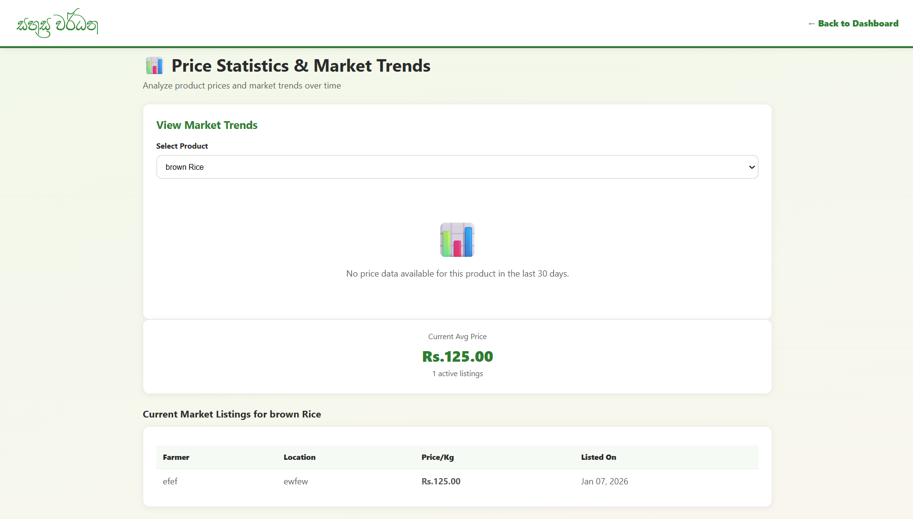

#  Sahasra Wardana - Agricultural Marketplace Platform

> **Connecting Farmers Directly to Buyers - A transparent marketplace eliminating middlemen**

Sahasra Wardana is a web-based platform that bridges the gap between farmers and buyers, enabling direct trade of agricultural products at fair wholesale prices. The system eliminates traditional middlemen, ensuring farmers get better profits while buyers access fresh produce at competitive rates.

---

## ✨ Features

### For Farmers 👨‍🌾
- ✅ **Product Management** - Add, edit, and delete product listings with images
- ✅ **Image Uploads** - Upload product photos (5MB max, validated)
- ✅ **Price Tracking** - Record daily prices for market trend analysis
- ✅ **Message Inbox** - Receive and manage buyer inquiries
- ✅ **Dashboard Analytics** - View statistics on products and messages
- ✅ **Product Categories** - Organize products (Vegetables, Fruits, Grains, Other)
- ✅ **Status Control** - Set products as Active or Inactive

### For Buyers 🛒
- ✅ **Product Browsing** - View all available products with detailed information
- ✅ **Search & Filter** - Find products by name and category
- ✅ **Farmer Details** - Access farmer location and contact information
- ✅ **Direct Messaging** - Send inquiries directly to farmers
- ✅ **Price Trends** - View historical price data and market insights
- ✅ **Real-time Listings** - See the latest product uploads

### Platform Features 📊
- ✅ **Price Statistics** - Interactive charts showing 30-day price trends
- ✅ **Market Analysis** - Average, min, max prices with trend indicators
- ✅ **Secure Authentication** - Password hashing with bcrypt
- ✅ **Responsive Design** - Mobile-friendly interface
- ✅ **User Roles** - Separate dashboards for farmers and buyers
- ✅ **Step-by-step Registration** - User-friendly 4-step signup process

---

## 📸 Demo images

### Homepage

### Farmer Dashboard

### Buyer Dashboard

### Price Statistics

---

## 🛠️ Tech Stack

| Technology | Purpose |
|-----------|---------|
| **PHP** | Server-side scripting |
| **MySQL** | Database management |
| **HTML** | Structure and markup |
| **CSS** | Styling and animations |
| **JavaScript** | Client-side interactions |
| **Chart.js** | Data visualization |
| **Apache/Nginx** | Web server |

---

## 🌟 Show Your Support

Give a ⭐️ if this project helped you!

---

**Shenol Disanakaya**

🌾 **Sahasra Wardana** 